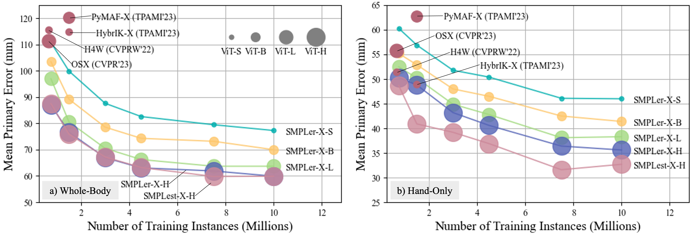

# SMPLest-X: Ultimate Scaling for Expressive Human Pose and Shape Estimation

This work is the extended version of [SMPLer-X](https://arxiv.org/abs/2309.17448). This new codebase is designed for easy installation and flexible development, enabling seamless integration of new methods with the pretrained SMPLest-X model.




## Useful links

<div align="center">
    <a href="https://arxiv.org/abs/2501.09782" class="button"><b>[arXiv]</b></a> &nbsp;&nbsp;&nbsp;&nbsp;
    <a href="https://caizhongang.github.io/projects/SMPLer-X/" class="button"><b>[Homepage]</b></a> &nbsp;&nbsp;&nbsp;&nbsp;
    <a href="https://youtu.be/DepTqbPpVzY" class="button"><b>[Video]</b></a> &nbsp;&nbsp;&nbsp;&nbsp;
    <a href="https://github.com/caizhongang/SMPLer-X" class="button"><b>[SMPLer-X]</b></a> &nbsp;&nbsp;&nbsp;&nbsp;
    <a href="https://github.com/open-mmlab/mmhuman3d" class="button"><b>[MMHuman3D]</b></a> &nbsp;&nbsp;&nbsp;&nbsp;
    <a href="https://github.com/wqyin/WHAC/tree/main" class="button"><b>[WHAC]</b></a></a>
    
</div>


## News

- [2025-02-17] Pretrained model available for download.
- [2025-02-14] 💌💌💌 Brand new codebase released for training, testing and inference.
- [2025-01-20] Paper released on [arXiv](https://arxiv.org/abs/2501.09782).
- [2025-01-08] Project page created.


## Install
```bash
bash scripts/install.sh
```

## Preparation

#### SMPLest-X pretrained models
- Download the pretrained **SMPLest-X-Huge model** weight from [here](https://huggingface.co/waanqii/SMPLest-X/tree/main) (8.2G).
- Place the pretrained weight and respective config file according to the file structure.

#### Parametric human models
- Download [SMPL-X](https://smpl-x.is.tue.mpg.de/) and [SMPL](https://smpl.is.tue.mpg.de/) body models.

#### ViT-Pose pretrained models (For training only)
- Follow [OSX](https://github.com/IDEA-Research/OSX) in preparing pretrained ViTPose models. Download the ViTPose pretrained weights from [here](https://github.com/ViTAE-Transformer/ViTPose).


The file structure should be like:
```
.
├── assets
├── configs
├── data
│   ├── annot # humandata.npz files
│   ├── cache # cached humandata
│   └── img # original data files
├── datasets
├── demo
├── human_models
│   └── human_model_files # parametric human models
├── main
├── models
├── outputs
│   └── smplest_x_h
├── pretrained_models
│   ├── vitpose_huge.pth # for training only
│   ├── yolov8x.pt # auto download during inference
│   └── smplest_x_h
│       ├── smplest_x_h.pth.tar
│       └── config_base.py
├── scripts
├── utils
├── README.md
└── requirements.txt
```

## Inference 

- Place the video for inference under `SMPLest-X/demo`
- Prepare the pretrained model under `SMPLest-X/pretrained_models`
- Pretrained YOLO model will be downloaded automatically during the first time usage.
- Inference output will be saved in `SMPLest-X/demo`

```bash
sh scripts/inference.sh {MODEL_DIR} {FILE_NAME} {FPS}

# For inferencing test_video.mp4 (30FPS) with SMPLest-X/pretrained_models/smplest_x_h/smplest_x_h.pth.tar
sh scripts/inference.sh smplest_x_h test_video.mp4 30
```


## Training
```bash
bash scripts/train.sh {JOB_NAME} {NUM_GPUS} {CONFIG_FILE}

# For training SMPLest-X-H with 16 GPUS
bash scripts/train.sh smplest_x_h 16 config_smplest_x_h.py
```
- CONFIG_FILE is the file name under `SMPLest-X/config`
- Logs and checkpoints will be saved to `SMPLest-X/outputs/train_{JOB_NAME}_{DATE_TIME}`


## Testing
```bash
sh scripts/test.sh {TEST_DATSET} {MODEL_DIR} {CKPT_ID}

# For testing the model SMPLest-X/outputs/smplest_x_h/model_dump/snapshot_5.pth.tar 
# on dataset SynHand
sh scripts/test.sh SynHand smplest_x_h 5
```
- NUM_GPU = 1 is used by default for testing
- Logs and results  will be saved to `SMPLest-X/outputs/test_{TEST_DATSET}_ep{CKPT_ID}_{DATE_TIME}`


## FAQ
- How do I animate my virtual characters with SMPLest-X output (like that in the demo video)? 
  - We are working on that, please stay tuned!
    Currently, this repo supports SMPL-X estimation and a simple visualization (overlay of SMPL-X vertices).


## Citation
```text
@article{yin2025smplest,
  title={SMPLest-X: Ultimate Scaling for Expressive Human Pose and Shape Estimation},
  author={Yin, Wanqi and Cai, Zhongang and Wang, Ruisi and Zeng, Ailing and Wei, Chen and Sun, Qingping and Mei, Haiyi and Wang, Yanjun and Pang, Hui En and Zhang, Mingyuan and Zhang, Lei and Loy, Chen Change and Yamashita, Atsushi and Yang, Lei and Liu, Ziwei},
  journal={arXiv preprint arXiv:2501.09782},
  year={2025}
}
```

## Explore More [SMPLCap](https://github.com/SMPLCap) Projects

- [arXiv'25] [SMPLest-X](https://github.com/SMPLCap/SMPLest-X): An extended version of [SMPLer-X](https://github.com/SMPLCap/SMPLer-X) with stronger foundation models.
- [ECCV'24] [WHAC](https://github.com/SMPLCap/WHAC): World-grounded human pose and camera estimation from monocular videos.
- [CVPR'24] [AiOS](https://github.com/SMPLCap/AiOS): An all-in-one-stage pipeline combining detection and 3D human reconstruction. 
- [NeurIPS'23] [SMPLer-X](https://github.com/SMPLCap/SMPLer-X): Scaling up EHPS towards a family of generalist foundation models.
- [NeurIPS'23] [RoboSMPLX](https://github.com/SMPLCap/RoboSMPLX): A framework to enhance the robustness of
whole-body pose and shape estimation.
- [ICCV'23] [Zolly](https://github.com/SMPLCap/Zolly): 3D human mesh reconstruction from perspective-distorted images.
- [arXiv'23] [PointHPS](https://github.com/SMPLCap/PointHPS): 3D HPS from point clouds captured in real-world settings.
- [NeurIPS'22] [HMR-Benchmarks](https://github.com/SMPLCap/hmr-benchmarks): A comprehensive benchmark of HPS datasets, backbones, and training strategies.
